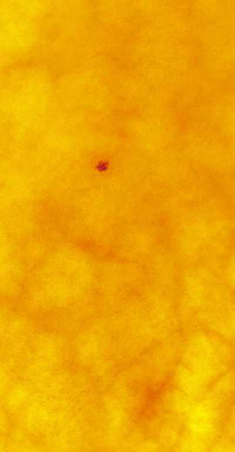
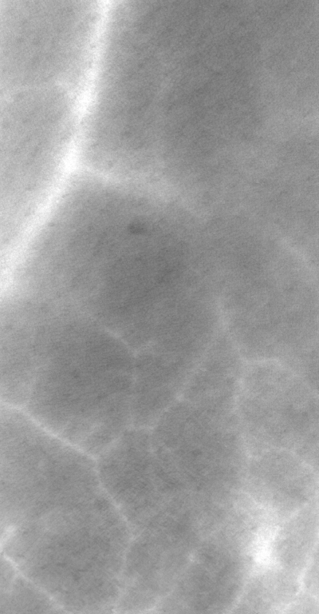
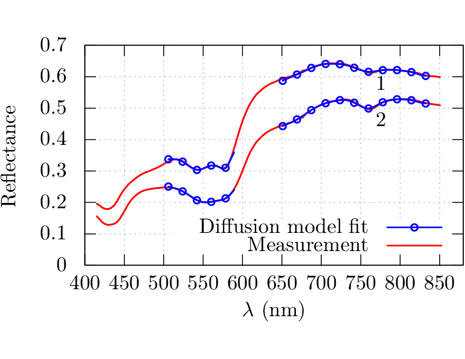

Physics-informed models are important for understanding 
the photon propagation through the tissue and the spectra
obtained in each pixel of the hyperspectral image. 

GPU-DM is an inverse model developed for 
estimating tissue constituents in each pixel of the hyperspectral
image by employing a two-layered diffusion model. Essentially
is each pixel labeled with physical information like oxygenation,
blood volume fraction, melanin amount, water content or other physical
properties in a depth-resolved way.

The independent nature of the employed model enables
optimal GPU computing. Initialization of the model
is done using `gpudm_initialize()`, which sets the model
parameters according to a configuration file. A BIL-interleaved
reflectance line is uploaded to the GPU using `gpudm_reinitialize()`. 
The parameters are fitted using `gpudm_fit_reflectance()`. Derived
parameters can be downloaded to the host using `gpudm_download_melanin()`, 
`gpudm_download_530res()` and `gpudm_download700res()`, into new BIL-interleaved
array with type of derived parameter along the band axis (oxyhemoglobin, deoxyhemoglobin, ...). 
For a complete example, see <a href="https://github.com/ntnu-bioopt/gpudm/blob/master/src/main.cpp">`main.cpp`</a>.

The model is described in <a href="{{ site.url }}/publications/#1136599">Bjorgan et al.</a> (complete citation: Bjorgan, M. Milanic, L. L. Randeberg, "Estimation of skin optical parameters for real-time hyperspectral imaging applications", J. Biomed. Opt. 19(6) (2014)).
A description is also available in this <a href="https://github.com/ntnu-bioopt/gpudm/blob/master/technicalreport.pdf">technical report</a>. 

