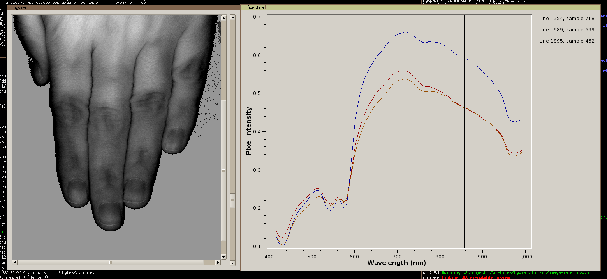

`hyview` is a simple hyperspectral image viewer written using the 
crossplatform GUI widget toolkit library Qt. 

The large amounts of data contained in a hyperspectral data cube
can make visualization difficult without employing 
processing methods. `hyview` provides
an efficient way to manually scroll through all the image bands. 
