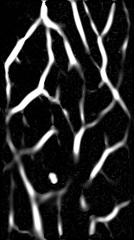

Extraction of vessel structures from medical images can be useful for investigation of endothelial function or hypervascularization.
`libfrangi` is an implementation of a standard vesselness filter often used
in various imaging modalities. It can also be used in hyperspectral imaging
([A. Bjorgan et al. (2015) "Vessel contrast enhancement in hyperspectral images", Proc. SPIE vol. 9318]({{ site.url }}/publications/#1231735))

A suitable implementation of this filter was already available as a [MATLAB
package](http://www.mathworks.com/matlabcentral/fileexchange/24409-hessian-based-frangi-vesselness-filter).
`libfrangi` represents a procedure-oriented C++ implementation. 
MATLAB calls were manually converted to equivalent OpenCV calls. 
It should also be possible to convert this code to pure C using OpenCV's C interface.

`libfrangi` provides an interface for supplying OpenCV `Mat` images and obtaining
a vesselness measure, a measure of vessel scale and vessel direction. All image operations
are implemented using OpenCV calls, which can provide a high performance to the algorithm. 
The results were found to be comparable to the original MATLAB scripts. 

