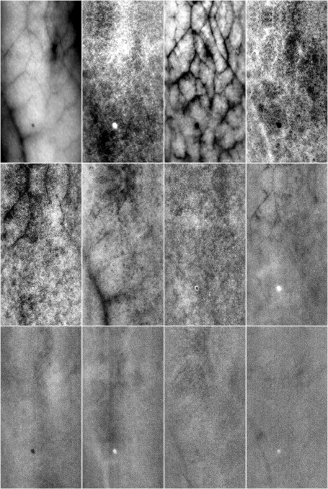
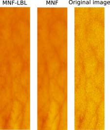

Due to the current state of sensor technology or insufficient
lightning conditions, hyperspectral images can be noisy. Denoising
is a necessary first step for any processing algorithm. We have
made available C++ source code
for denoising by employing variations of the Minimum Noise Fraction (MNF) 
transform. 

The work is also published in [Bjorgan et al.]({{ site.url }}/publications/#1216144) (full citation: A. Bjorgan, L. L. Randeberg, "Real-time noise removal for line-scanning hyperspectral devices using a minimum noise fraction-based approach", Sensors 15(2), 2015. Open access). 

The work implements both a fast version of the conventional MNF transform
and a modification for denoising line-by-line, which
can be convenient for some real-time line-scanning applications. 

Conventional denoising: MNF
---------------------------

Conventional MNF is a linear matrix transform which 
reorders the hyperspectral data cube into a signal space where the bands 
are ordered by signal-to-noise ratio. This matrix transform
is obtained from estimates of the noise and image covariances.
For further details, see either [Bjorgan et al.]({{ site.url }}/publications/#1216144)
or [Green et al.](http://dx.doi.org/10.1109/36.3001)

The steps are implemented in [`mnf.cpp`](https://github.com/ntnu-bioopt/mnf/blob/master/src/mnf_c.cpp):

The neccessary image and noise covariance matrices are estimated using
`mnf_estimate_statistics()`.
MNF transformation matrices are calculated using `mnf_calculate_forward_transf_matrix()` and `mnf_calculate_inverse_transf_matrix()`, based on the 
estimated statistics. 
The transforms are applied to the hyperspectral image using `mnf_run_forward()` and `mnf_run_inverse()`.
The total denoising
operation is implemented in `mnf_run()`. See [`main.cpp`](https://github.com/ntnu-bioopt/mnf/blob/master/src/main.cpp) for a more complete
example. 

Complete denoising of a hyperspectral image using 8 of the first MNF bands in inverse can be done using 
`mnf --num-bands 8 hyperimage.img --output hyperimage_denoised`. The denoised output will be saved as `hyperimage_denoised_inversetransformed.img`. 

An example of forward transformed results was shown above. Denoising
can in this case be done by constraining the inverse transform to the
first 8 bands of the transformed image. 

Real-time denoising: MNF-LBL
----------------------------

Time-critical medical application of hyperspectral imaging
requires real-time processing of the hyperspectral images
at the time of acquisition. For line-scanning setups, this
means that the processing algorithms must be run line by line. 

The MNF algorithm has been modified to denoise the image
online by estimating the covariances line by line and
estimate transformation matrices based on the preliminary estimate. 
The basic code is implemented in [`mnf_linebyline.cpp`](https://github.com/ntnu-bioopt/mnf/blob/master/src/mnf_linebyline.cpp):
Each line of data is denoised in place using `mnf_linebyline_run_oneline()`. For details, refer to this function. 

Complete denoising of a hyperspectral image using 8 of the first MNF bands and 
this technique can be done using `mnf --num-bands 8 --line-by-line hyperimage.img --output hyperimage_denoised`.
